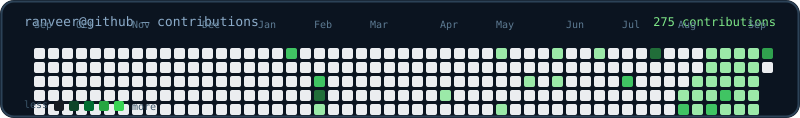

  

 

## ──── About

I build things that make me curious.

I started with websites and automation, then kept moving closer to the system itself — language models, agent infrastructure, on-device AI, security, and developer tooling.

Most of my work starts with a question that sounds slightly unreasonable: **can this be built differently?**

I learn by reading papers, breaking things, rebuilding them, and shipping the result.

> **Build the thing. Understand the thing. Then make it useful.**

 

## ──── Selected Work

<table width="100%">
<tr>
<td width="50%" valign="top">
<h3>🛡️&nbsp; Viking</h3>

<b>On-device security for Android.</b>

Six threat shields for SMS, calls, UPI links, APKs, NFC and permissions, with local Gemma inference and encrypted storage.

  

<a href="https://github.com/RABNEER/Viking"><b>view project →</b></a>
</td>
<td width="50%" valign="top">
<h3>⚡&nbsp; AgentBox</h3>

<b>Infrastructure for autonomous agents.</b>

Identity, mailboxes, scoped capabilities, verification workflows and agent-to-agent task delegation — built for machine-native software.

  

<a href="https://github.com/RABNEER/AgentBox"><b>view project →</b></a>
</td>
</tr>
<tr>
<td width="50%" valign="top">
<h3>🧠&nbsp; StreamTransformer</h3>

<b>Transformer execution without requiring the whole model in VRAM.</b>

Layer streaming, asynchronous weight transfers and low-VRAM execution for constrained hardware.

  

<a href="https://github.com/RABNEER/stream-transformer"><b>view project →</b></a>
</td>
<td width="50%" valign="top">
<h3>🏗️&nbsp; Apocalypto-Env</h3>

<b>Adversarial RL environment for scam-aware agents.</b>

An OpenEnv environment where agents classify threats, extract artifacts and interact with a stateful scammer.

  

<a href="https://github.com/RABNEER/Apocalypto-env"><b>view project →</b></a>
</td>
</tr>
<tr>
<td width="50%" valign="top">
<h3>🧬&nbsp; LightLLM</h3>

<b>A 124M-parameter language model built from scratch.</b>

A hands-on GPT-style implementation covering tokenization, attention, training and inference without hiding behind an API.

 

<a href="https://github.com/RABNEER/LightLLM"><b>view project →</b></a>
</td>
<td width="50%" valign="top">
<h3>⌘&nbsp; Elsewhere</h3>

<b>More experiments live in the repos.</b>

Product experiments, smaller tools, prototypes and unfinished ideas stay off the profile unless they earn their place.

<a href="https://github.com/RABNEER?tab=repositories"><b>browse repositories →</b></a>
</td>
</tr>
</table>

 

## ──── System Monitor

 

## ──── How I Think

<table width="92%">
<tr><td>
 

<i>“Nobody actually wants the thing you build. They want what it does for them.”</i>

 
</td></tr>
</table>

I learned this through building for other people — shipping software is not the same thing as solving the problem underneath it.

So I try to think **outcome first, implementation second**.

 

## ──── Stack

I'll learn whatever the problem needs.

 

## ──── Activity

 

## ──── Contact

 

**build · learn · ship · repeat**

  

